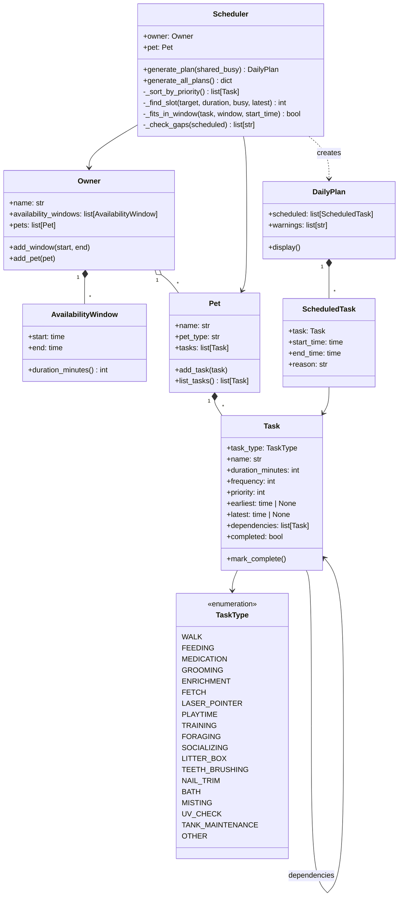

# PawPal+ UML Class Diagram (Final Implementation)

```mermaid
classDiagram
    class TaskType {
        <<enumeration>>
        WALK
        FEEDING
        MEDICATION
        GROOMING
        ENRICHMENT
        FETCH
        LASER_POINTER
        PLAYTIME
        TRAINING
        FORAGING
        SOCIALIZING
        LITTER_BOX
        TEETH_BRUSHING
        NAIL_TRIM
        BATH
        MISTING
        UV_CHECK
        TANK_MAINTENANCE
        OTHER
    }

    class Task {
        +task_type: TaskType
        +name: str
        +duration_minutes: int
        +frequency: int
        +priority: int
        +earliest: time | None
        +latest: time | None
        +dependencies: list[Task]
        +completed: bool
        +mark_complete()
    }

    class AvailabilityWindow {
        +start: time
        +end: time
        +duration_minutes() int
    }

    class Owner {
        +name: str
        +availability_windows: list[AvailabilityWindow]
        +pets: list[Pet]
        +add_window(start, end)
        +add_pet(pet)
    }

    class Pet {
        +name: str
        +pet_type: str
        +tasks: list[Task]
        +add_task(task)
        +list_tasks() list[Task]
    }

    class ScheduledTask {
        +task: Task
        +start_time: time
        +end_time: time
        +reason: str
    }

    class DailyPlan {
        +scheduled: list[ScheduledTask]
        +warnings: list[str]
        +display()
    }

    class Scheduler {
        +owner: Owner
        +pet: Pet
        +generate_plan(shared_busy) DailyPlan
        +generate_all_plans() dict
        -_sort_by_priority() list[Task]
        -_find_slot(target, duration, busy, latest) int
        -_fits_in_window(task, window, start_time) bool
        -_check_gaps(scheduled) list[str]
    }

    Task --> TaskType
    Task --> Task : dependencies
    Owner "1" *-- "*" AvailabilityWindow
    Owner "1" o-- "*" Pet
    Pet "1" *-- "*" Task
    ScheduledTask --> Task
    DailyPlan "1" *-- "*" ScheduledTask
    Scheduler --> Owner
    Scheduler --> Pet
    Scheduler ..> DailyPlan : creates
```
